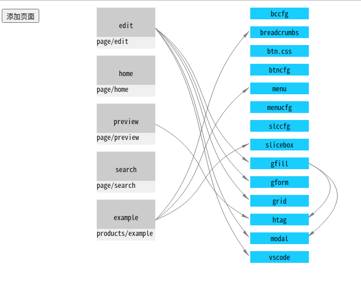

# potato

基于 `svelte` 做的修改

没有 `webpack`, 没有 `node_modules`, 没有 `node`

## 环境

`deno` install:

	https://deno.land/#installation

## 运行

	./run.sh

	http://localhost:3000/#/home

## 功能介绍

1.碎片化加载

2.组件依赖关系可视化

3.自动代码生成

### 碎片化加载

1.按页面异步加载,按需打包,不用配置懒加载

2.单个文件很小(未压缩就很小),加载基本无感知

### 依赖关系可视化

1.项目编译自动扫描组件的引用关系,方便快速理解项目

2.为调整和修改项目提供决策依据

### 代码自动生成

1.页面使用grid布局分割成若干item,在每个item中可选择填入组件,配置后,自动生成页面.

2.生成的代码简洁,开发人员可直接使用,旨在帮助开发人员解决初期重复性工作

3.页面生成步骤

3.1.选择和编辑grid布局

3.2.调整css和选择组件

3.3.预览或生成页面

3.4.添加业务逻辑

